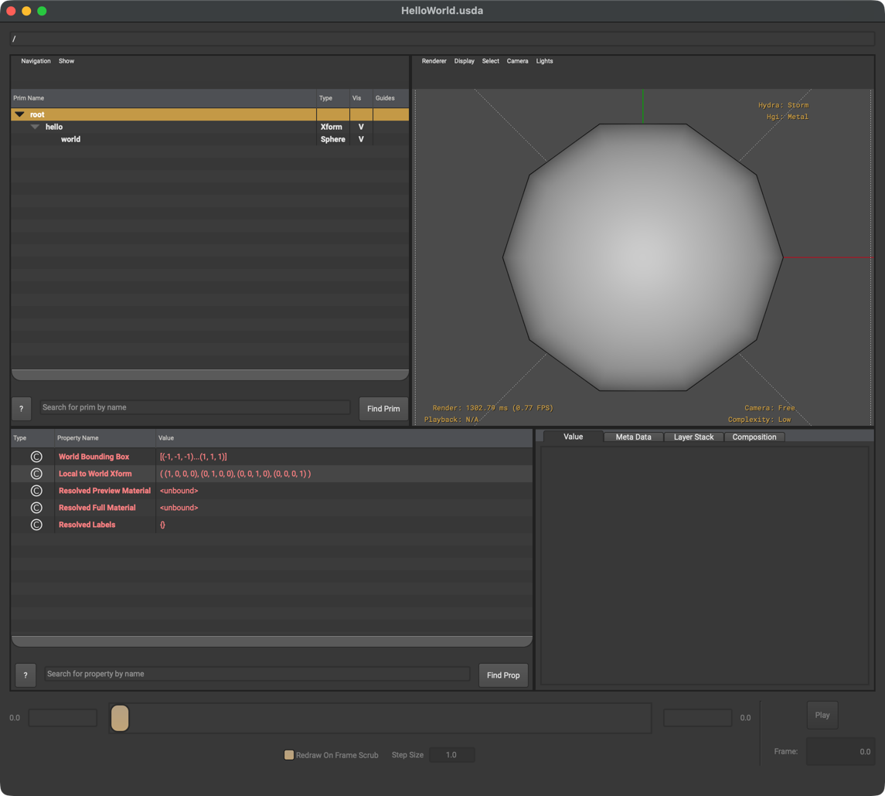

# OpenUSD Project Setup

This repository includes the setup for OpenUSD in convenience.

Before you start, make sure you have [Just command runner](https://github.com/casey/just) installed:


## 1.Clone the repository

---

```bash
$ git clone https://github.com/gchoi/OpenUSD-Project.git
$ cd OpenUSD-Project
```

## 2. Set up environment & Build OpenUSD

---

```bash
$ just build-openusd
```

## 3. Add environment variables

---

> **NOTE**: If you're using .bashrc, replace `~/.zshrc` with `~/.bashrc` in `add-env-vars` command set of [Justfile](./Justfile).

```bash
$ just add-env-vars
```

Added environment variables should look like this:

```bash
$ cat ~/.zshrc

export PYTHONPATH="/Users/achoi/Documents/Projects/Simulation/OpenUSD-Project/installation/lib/openusd"
export PATH="/Users/achoi/Documents/Projects/Simulation/OpenUSD-Project/bin:$PATH"
```

## 4. Clean up

---

Now let's clean up the unnecessary files and directories needed for building the project.

```bash
$ just clean-up
```

## 5. Set up the Python environment for the OpenUSD project

---

```bash
$ just setup-openusd
```


## 6. Test

---

If everything is set up correctly, you should be able to run the following command:

```bash
$ just hello-world
```

